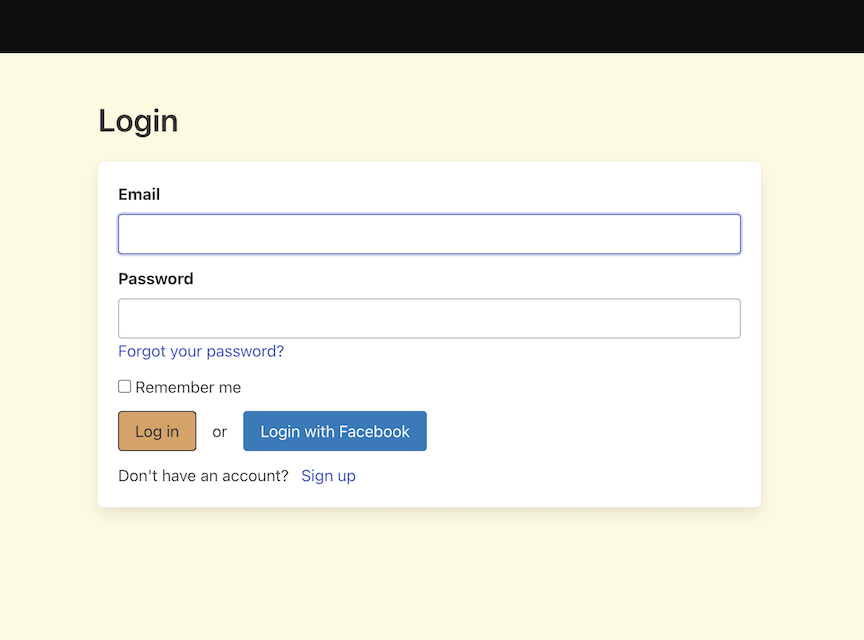
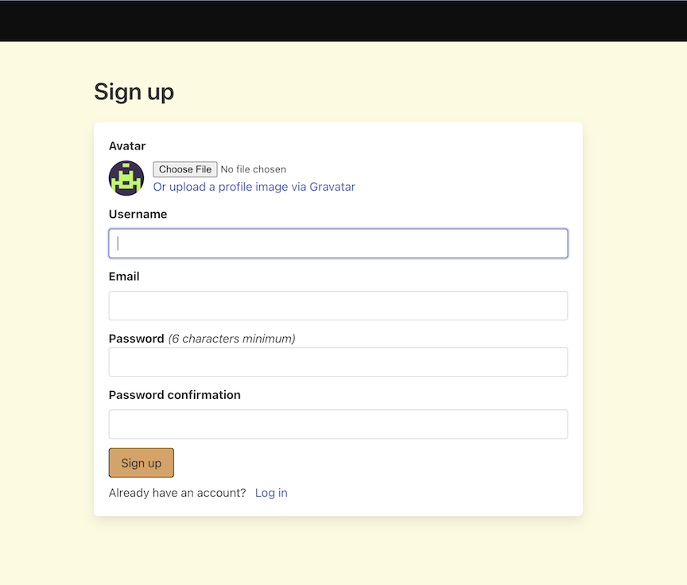
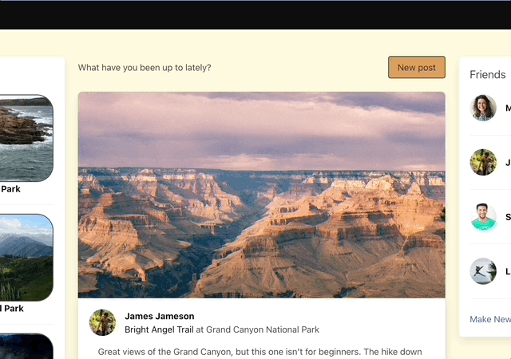
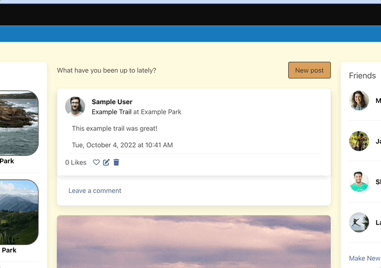
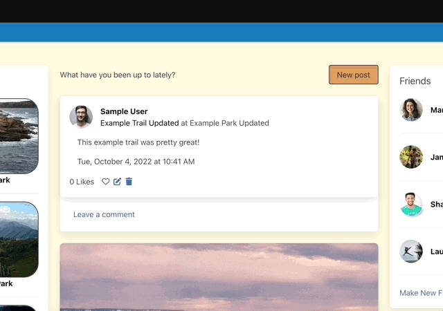
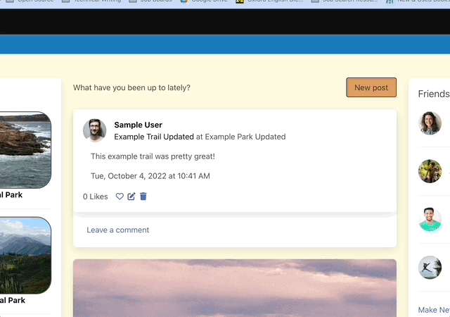
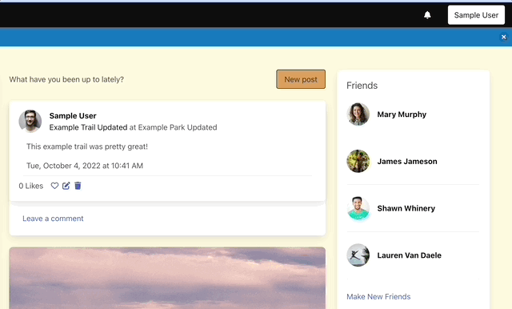
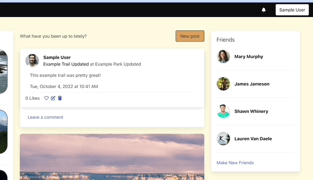

# HikerBook


The social media platform for lovers of the great outdoors. Make friends with fellow hikers, post about your most recent hike, and explore new trails and parks posted by other users.

This is a practice project created as part of the curriculum at [The Odin Project](theodinproject.com). It was built using Ruby on Rails, Devise for user authentication, Hotwire for single-page layout and live updates, and Bulma for styling. Project specs can be found [here](https://www.theodinproject.com/lessons/ruby-on-rails-rails-final-project).


## Table of Contents

- [Getting Started](#getting-started)
- [Installation](#installation)
- [Usage](#usage)
- [Specs](#specs)
- [Credits](#credits)

## Getting Started



You can access a live version of the app at https://hikerbook-production.up.railway.app/ When you reach the site, you will need to login or signup.




To signup as a new user, click the 'Sign Up' button. Enter your email, username, and password, and upload an avatar from your local files or using Gravatar.

You can also login using your Facebook account. At the login screen, press the blue 'Login with Facebook' button. You will be directed to Facebook, and after logging in there you will be returned to the main page of HikerBook.

Alternatively, you can access the site quickly using the sample user credentials listed below. These credentials will allow you to experience the main features of HikerBook more quickly.

> Sample User Credentials  
> Email: user@example.com  
> Password: password  

## Installation

If you would prefer to experiment with a local copy of the app, make sure you have the following prerequisites on your machine.

> Prerequisites  
> - Ruby 3.1.2
> - Rails 7.0.3  
> - Redis 4.0  
> - libvips  

Enter the commands below in your terminal to get started.

```sh
git clone git@github.com:mjande/hikerbook.git  
bundle install  
rails db:create  
rails db:migrate 
brew services start redis # for MacOS users. Other users should consult the docs at https://redis.io/docs/getting-started/ for installing and starting Redis 
rails db:seed # if you would like access to seed data for users, posts, and comments
bin/dev
```

## Usage



To create a post, click the 'New Post' button on the main page. Tell your friends what trail you hiked, where it was, and write a short description if you like. You can also attach an image by clicking Choose File under the 'Image (optional)' heading. When you're done, click create post to add your post to your friends' streams and your own.



To update one of your posts, click the edit icon (a pencial on a small square) just above the comments on your post. A form will appear, where you can edit any aspect of your previously created post. Once you click 'Update Post', your newly updated post will apear on both your friends' streams and your own.



To leave a comment, find the 'Leave a comment' link beneath the post you wish to comment on. Click that link, and fill in the text box with the thoughts you want to share. When you're done, 'Submit'. Your comment will appear underneath the post for any users with access to that post (friends of the original poster).



To like a post, click the heart underneath the post description. Previously liked posts are indicated by a filled-in heart icon. Unliked posts are indicated by a hollow heart icon



To find new friends, click the 'Make New Friends' link in the Friends sidebar on the right hand side. You will see a list of all HikerBook users, categorized by your relationship with them (Friends, Friends requested by you or who have requested you, and Potential Friends). Scroll to the 'Potential Friends' list at the bottom of the page. If you see a user you are interested in friending, click the 'Send Friend Request' buttom next to the name. They will need to accept your request before you will be friends.



You can check on any incoming friend requests by hovering over the noticiations (bell) icon near the top of your screen. (Mobile users will need to access the menu by clicking the three-lined menu icon). You will see a number, indicating how many friend requests you have received but not yet answered. Click the link titled "View Friend Requests" to go to the friend requests page, where you can view these requests and see any requests that you have sent. To accept a request, click 'Add Friend', and to reject a request, click 'Ignore'.

## Specs

To run the specs, make sure you have RSpec (3.11) installed.

```sh
bundle exec rspec # run all specs
bundle exec rspec spec/models # run model specs
bundle exec rspec spec/system # run system specs
```

## Credits

I am grateful for the support, guidance, and inspiration offered by the folks at [the Odin Project](theodinproject.com) and their Discord.

Avatars and other images come from [pexels.com](pexels.com). A list of sources can be found [here](image_sources.txt).
